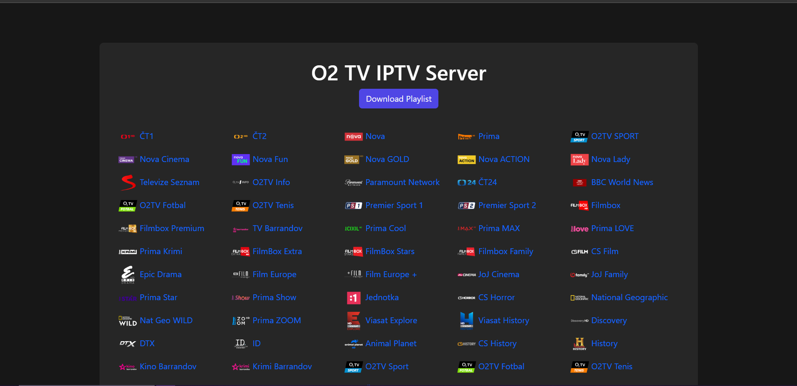

# O2 TV IPTV Server

[](https://github.com/goodbyepavlyi/o2tv-iptvserver/actions/workflows/docker-image.yml)
[](https://hub.docker.com/r/goodbyepavlyi/o2tv-iptvserver)
[](https://hub.docker.com/r/goodbyepavlyi/o2tv-iptvserver)


<p align="center">
  
</p>

## Installation

To automatically install & run the container, simply download the [docker-compose.yml]([https://github.](https://github.com/goodbyepavlyi/o2tv-iptvserver/blob/master/docker-compose.yml)) and run `docker-compose up -d`

> You have to replace the WEBSERVER_PUBLICURL variable.

## Update

To keep your O2 TV IPTV Server up to date, follow these steps:

#### 1. Pull the Latest Docker Image

```bash
docker-compose pull
```

This command will fetch the latest version of the O2 TV IPTV Server Docker image from the Docker Hub.


#### 2. Restart the Container
```
docker-compose up -d
```

By running this command, you'll restart the O2 TV IPTV Server container with the latest image. Your server will now be running the most recent version.

That's it! Your O2 TV IPTV Server is now updated and ready to go. Enjoy the latest features and improvements.